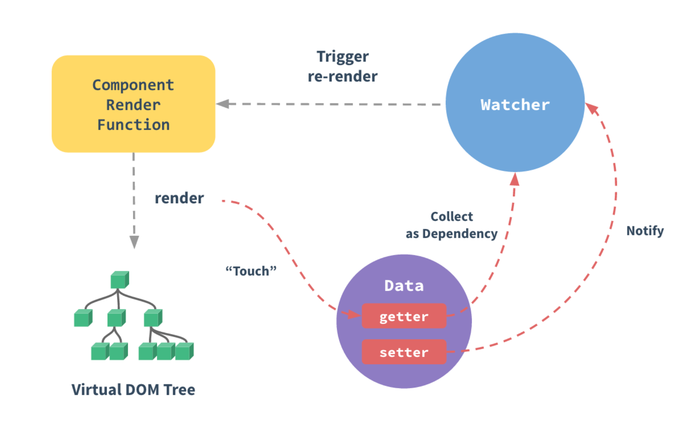

# 响应式原理

## 我的疑惑

最近在学习vue的源码，看了好几篇辅助学习的博客，自己仍然有很多疑惑，感觉自己的这些疑惑在内行人看来可能很小儿科，但是觉得还是很有必要记录一下的。疑惑的点主要有：
* wather, dep, observe, defineReactive之间的关系是怎样的？
* 如何进行依赖收集，虽然知道主要在getter中触发，但是有点不明白Dep.target的用意？
* watcher和dep是一个组件实例化一个，还是一个data的属性实例化一个，还是一个依赖实例化一个？自己有点分不清this的指向

## 从入口文件讲起

回到最初的起点，阅读源码首先找到它的入口文件，这里主要陈述从入口文件到响应式变化的这一段过程，虚拟DOM这些选择性忽略。从package.json我们发现了入口文件` src/plateforms/entry-runtime-with-compiler.js ` .

### Vue的真正来源

通过一个一个文件的查找，我们发现Vue最终来自`/src/core/instance/index.js`,这里的代码主要对各个部分进行初始化：
```javascript
initMixin(Vue)
//初始化状态很重要，这里就是数据响应式变化的处理
stateMixin(Vue)
eventsMixin(Vue)
lifecycleMixin(Vue)
renderMixin(Vue)
```
在`stateMinxin`中主要依靠`Object.defineProperty()`这个函数，这个函数可以在对象上定义一个新属性或者修改对象上的属性，相关联的封装函数`defineReactive`代码如下：
```javascript
export function defineReactive (
  obj: Object,
  key: string,
  val: any,
  customSetter?: ?Function,
  shallow?: boolean
) {
  const dep = new Dep()

  const property = Object.getOwnPropertyDescriptor(obj, key)
  if (property && property.configurable === false) {
    return
  }

  // cater for pre-defined getter/setters
  const getter = property && property.get
  const setter = property && property.set
  if ((!getter || setter) && arguments.length === 2) {
    val = obj[key]
  }

//observe函数很重要
  let childOb = !shallow && observe(val)

  Object.defineProperty(obj, key, {
    enumerable: true,
    configurable: true,
    get: function reactiveGetter () {
      const value = getter ? getter.call(obj) : val
      if (Dep.target) {
        dep.depend()
        if (childOb) {
          childOb.dep.depend()
          if (Array.isArray(value)) {
            dependArray(value)
          }
        }
      }
      return value
    },
    set: function reactiveSetter (newVal) {
      const value = getter ? getter.call(obj) : val
      /* eslint-disable no-self-compare */
      if (newVal === value || (newVal !== newVal && value !== value)) {
        return
      }
      /* eslint-enable no-self-compare */
      if (process.env.NODE_ENV !== 'production' && customSetter) {
        customSetter()
      }
      // #7981: for accessor properties without setter
      if (getter && !setter) return
      if (setter) {
        setter.call(obj, newVal)
      } else {
        val = newVal
      }
      childOb = !shallow && observe(newVal)
      dep.notify()
    }
  })
}
```
`observe()`为响应式的数据设置了一个__ob__的属性作为标记，里面存放了该属性的观察器，也就是Observer的实例，防止重复绑定。`Observer`为数据加上响应式属性进行双向绑定。如果是对象则进行深度遍历，为每一个子对象都绑定上方法，如果是数组则为每一个成员都绑定上方法。
observe和实例Observer代码如下(在`./core/observer/index.js`):
```javascript
export class Observer {
  value: any;
  dep: Dep;
  vmCount: number; // number of vms that have this object as root $data

  constructor (value: any) {
    this.value = value
    this.dep = new Dep()
    this.vmCount = 0
    def(value, '__ob__', this)
    if (Array.isArray(value)) {
      if (hasProto) {
        protoAugment(value, arrayMethods)
      } else {
        copyAugment(value, arrayMethods, arrayKeys)
      }
      this.observeArray(value)
    } else {
      this.walk(value)
    }
  }

  /**
   * Walk through all properties and convert them into
   * getter/setters. This method should only be called when
   * value type is Object.
   */
  walk (obj: Object) {
    const keys = Object.keys(obj)
    for (let i = 0; i < keys.length; i++) {
      defineReactive(obj, keys[i])
    }
  }

  /**
   * Observe a list of Array items.
   */
  observeArray (items: Array<any>) {
    for (let i = 0, l = items.length; i < l; i++) {
      observe(items[i])
    }
  }
}

export function observe (value: any, asRootData: ?boolean): Observer | void {
  if (!isObject(value) || value instanceof VNode) {
    return
  }
  let ob: Observer | void
  if (hasOwn(value, '__ob__') && value.__ob__ instanceof Observer) {
    ob = value.__ob__
  } else if (
    shouldObserve &&
    !isServerRendering() &&
    (Array.isArray(value) || isPlainObject(value)) &&
    Object.isExtensible(value) &&
    !value._isVue
  ) {
    ob = new Observer(value)
  }
  if (asRootData && ob) {
    ob.vmCount++
  }
  return ob
}
```


### $mount到底干了什么
这个入口文件定义了$mount()函数，代码的主要内容为判断挂载点，提供渲染函数。代码如下：
```javascript
const mount = Vue.prototype.$mount
Vue.prototype.$mount = function (
  el?: string | Element,
  hydrating?: boolean
): Component {
  el = el && query(el)

  /* istanbul ignore if */
  if (el === document.body || el === document.documentElement) {
    process.env.NODE_ENV !== 'production' && warn(
      `Do not mount Vue to <html> or <body> - mount to normal elements instead.`
    )
    return this
  }

  const options = this.$options
  // resolve template/el and convert to render function
  if (!options.render) {
    let template = options.template
    if (template) {
      if (typeof template === 'string') {
        //...code
      } else if (template.nodeType) {
        template = template.innerHTML
      } else {
        if (process.env.NODE_ENV !== 'production') {
          warn('invalid template option:' + template, this)
        }
        return this
      }
    } else if (el) {
      template = getOuterHTML(el)
    }
    if (template) {
      /* istanbul ignore if */
      //...code
 
    }
  }
  return mount.call(this, el, hydrating)
}
```
在这个函数里面，最后都会调用`return mount.call(this, el, hydrating)`,通过查找，我们发现函数定义在`/src/plateforms/runtime/index.js`文件中，其中`return mountComponent(this, el, hydrating)`又从`import { mountComponent } from 'core/instance/lifecycle'`import进来。打开`/src/code/instance/lifecycle.js`,代码如下：
```javascript
export function mountComponent (
  vm: Component,
  el: ?Element,
  hydrating?: boolean
): Component {
  vm.$el = el
  if (!vm.$options.render) {
    //...code
  }
  callHook(vm, 'beforeMount')

  let updateComponent
  /* istanbul ignore if */
  if (process.env.NODE_ENV !== 'production' && config.performance && mark) {
    updateComponent = () => {
      //...code
    }
  } else {
    updateComponent = () => {
      vm._update(vm._render(), hydrating)
    }
  }

  // we set this to vm._watcher inside the watcher's constructor
  // since the watcher's initial patch may call $forceUpdate (e.g. inside child
  // component's mounted hook), which relies on vm._watcher being already defined
  //这就是我们想找的，这里new了一个Watcher实例对象，观察者对象，接下来我们就可以开始响应式原理的解析了，期待地搓搓手
  new Watcher(vm, updateComponent, noop, {
    before () {
      if (vm._isMounted && !vm._isDestroyed) {
        callHook(vm, 'beforeUpdate')
      }
    }
  }, true /* isRenderWatcher */)
  hydrating = false

  // manually mounted instance, call mounted on self
  // mounted is called for render-created child components in its inserted hook
  if (vm.$vnode == null) {
    vm._isMounted = true
    callHook(vm, 'mounted')
  }
  return vm
}
```
#### watcher类
`Watcher`在`/src/core/observe/watcher.js`，同时还有其他的文件为`array.js`,`dep.js`,`index.js`,`schedule.js`,`traverse.js`.
`watcher.js`的代码如下,主要其中几个重要的函数：
```javascript
 get () {
    pushTarget(this)
    let value
    const vm = this.vm
    try {
      value = this.getter.call(vm, vm)
    } catch (e) {
      if (this.user) {
        handleError(e, vm, `getter for watcher "${this.expression}"`)
      } else {
        throw e
      }
    } finally {
      // "touch" every property so they are all tracked as
      // dependencies for deep watching
      if (this.deep) {
        traverse(value)
      }
      popTarget()
      this.cleanupDeps()
    }
    return value
  }

  /**
   * Add a dependency to this directive.
   */
addDep (dep: Dep) {
    const id = dep.id
    if (!this.newDepIds.has(id)) {
      this.newDepIds.add(id)
      this.newDeps.push(dep)
      if (!this.depIds.has(id)) {
        dep.addSub(this)
      }
    }
}

  /**
   * Clean up for dependency collection.
   */
cleanupDeps () {
    let i = this.deps.length
    while (i--) {
      const dep = this.deps[i]
      if (!this.newDepIds.has(dep.id)) {
        dep.removeSub(this)
      }
    }
}

update () {
    /* istanbul ignore else */
    if (this.lazy) {
      this.dirty = true
    } else if (this.sync) {
      this.run()
    } else {
      queueWatcher(this)
    }
}

depend () {
    let i = this.deps.length
    while (i--) {
      this.deps[i].depend()
    }
}
```
Watcher是一个观察者对象，主要作用是数据更新之后响应式地更新视图。
####  Dep类
一个发布者，可以订阅多个观察者，依赖收集之后Deps中就会存在一个或者多个Watcher对象，数据变更通知所有观察者对象进行更新。
```javascript
export default class Dep {
  static target: ?Watcher;
  id: number;
  subs: Array<Watcher>;

  constructor () {
    this.id = uid++
    this.subs = []
  }

  addSub (sub: Watcher) {
    this.subs.push(sub)
  }

  removeSub (sub: Watcher) {
    remove(this.subs, sub)
  }

  depend () {
    if (Dep.target) {
      Dep.target.addDep(this)
    }
  }

  notify () {
    // stabilize the subscriber list first
    const subs = this.subs.slice()
    if (process.env.NODE_ENV !== 'production' && !config.async) {
      // subs aren't sorted in scheduler if not running async
      // we need to sort them now to make sure they fire in correct
      // order
      subs.sort((a, b) => a.id - b.id)
    }
    for (let i = 0, l = subs.length; i < l; i++) {
      subs[i].update()
    }
  }
}
```

总结上面的两个类，作用主要如下:
1.全局引进Dep,和pushTaeget(),get函数将观察者对象保存进Dep.target
2.接着调用了defineReactive中的get实现依赖收集，代码如下(看注释):
```javascript
    get: function reactiveGetter () {
      const value = getter ? getter.call(obj) : val
      //如果存在观察者
      if (Dep.target) {
        //收集依赖
        dep.depend()
        if (childOb) {
          childOb.dep.depend()
          if (Array.isArray(value)) {
            dependArray(value)
          }
        }
      }
      return value
    }
```
其中`dep.depend()`代码如下：
```javascript
  depend () {
    if (Dep.target) {
      //this指向defineReactive实例化的dep,这样便 完成了依赖收集
      Dep.target.addDep(this)
    }
  }
```
当我们修改代码的时候,就会调用set,set调用notify触发响应，每个观察者的update函数就会被调用。

## 总结




#### 参考文章
[从源码角度再看数据绑定](https://github.com/answershuto/learnVue/blob/master/docs/%E4%BB%8E%E6%BA%90%E7%A0%81%E8%A7%92%E5%BA%A6%E5%86%8D%E7%9C%8B%E6%95%B0%E6%8D%AE%E7%BB%91%E5%AE%9A.MarkDown)

[Dynamic Data - Observer, Dep and Watcher](https://github.com/numbbbbb/read-vue-source-code/blob/master/04-dynamic-data-observer-dep-and-watcher.md)

[从源码解析vue的响应式原理-依赖收集、依赖触发](https://juejin.im/post/5b66e3296fb9a04f9e23321c)

[从源码解析vue的响应式原理-响应式的整体流程](https://juejin.im/post/5b94e0e95188255c5b5c19f7)